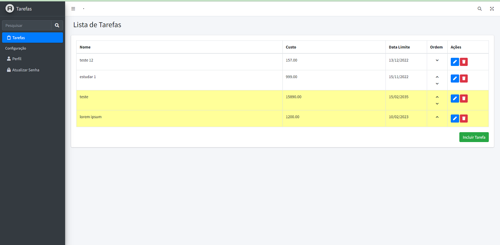

## Sobre o Projeto - Lista de Tarefas

É um sistema web para cadastro de Tarefas utilizando Laravel, os dados são mantidos em um banco de dados MySQL.

Base de dados
Tabela: Tarefas
Campos:
- Identificador da tarefa (chave primária)
- Nome da tarefa
- Custo (R$)
- Data limite
- Ordem de apresentação (campo numérico, não repetido, que servirá para ordenar os registros na tela)

## Funcionalidades:
### Lista de Tarefas
É a página principal do sistema.
Deve listar todos os registros mantidos na tabela Tarefas; (um abaixo do outro).
Todos os campos, exceto Ordem de apresentação, são apresentados.
As tarefas são apresentadas ordenadas pelo campo Ordem de apresentação.
A tarefa que tem o Custo, maior ou igual a R$1.000,00 é apresentada de forma diferente.
Ao lado direito de cada registro são apresentados dois botões com icones, um para executar a função de Editar e outro para a função de Excluir registro.
Ao final da listagem existe um botão para executar a função de Incluir registro.

### Excluir
A função deve excluir o registro da Tarefa escolhida.
É apresentado uma mensagem de confirmação (Sim/Não) para a realização da exclusão.

### Editar
A função serve para editar o registro da Tarefa escolhida.
Só é possível alterar o Nome da Tarefa, o Custo e a Data Limite.
Existem validações para verificar se o novo nome da tarefa já existe na base de dados. Se já existir, a alteração não poderá ser feita.
Ao clicar no botão é aberto uma nova janela para edição dos três campos.

### Incluir
A função serve para a inclusão de uma nova tarefa.
Apenas os campos Nome da Tarefa, Custo e Data Limite são informados pelo usuário.
Os demais campos são gerados automaticamente pelo sistema.
O registro recém-criado será o último na ordem de apresentação.
Não pode haver duas tarefas com o mesmo nome.

### Reordenação das tarefas
A função serve para permitir que o usuário possa alterar a ordem de apresentação de uma tarefa.
Em cada linha existem dois botões, um para subir a tarefa na ordem de apresentação e outro para descer. 
Obviamente a primeira tarefa não pode subir e nem a última pode descer.

## Imagens

